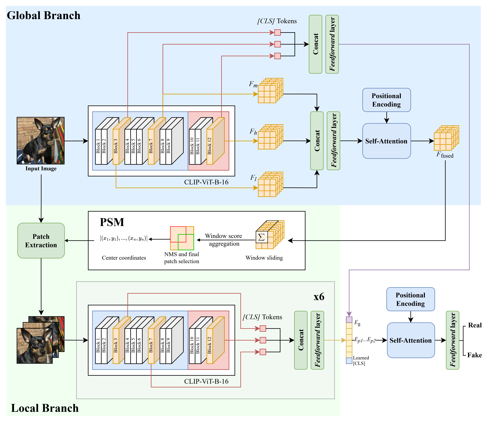

# CLIFF: Generalizable AI-Generated Image Detection via Local and Global Feature Fusion

PyTorch implementation of a generalizable synthetic image detector based on the fusion of **global multi-level features** and **local image features** extracted from informative regions.

This repository contains the implementation and experiments for:

> **A Generalizable Method for Synthetic Image Detection via Local and Global Feature Fusion**  
> Tomas J. Santana Morena  
> Universidad Rafael Urdaneta

> Note: Article URL and DOI will be provided once the paper is published.

The method is designed to improve generalization across unseen image generators while remaining robust to common post-processing operations such as JPEG compression and Gaussian blur.



Model weights are hosted on [huggingface](https://huggingface.co/tomassantana/CLIFF).

## Overview

Modern generative models can produce images that are increasingly difficult to distinguish from real photographs. While deep learning detectors can achieve very high performance when tested on generators similar to those seen during training, their performance often decreases significantly when evaluated on previously unseen generative models.

Another important challenge is robustness. Common image transformations such as JPEG compression or Gaussian blur can remove or alter the artifacts used by synthetic-image detectors, reducing their effectiveness.

This project explores a detector that combines two complementary sources of visual information:

- **Global features**, which capture semantic and structural information from the complete image.
- **Local features**, extracted from informative regions where discriminative artifacts may be concentrated.

Both representations are extracted using a pretrained **CLIP ViT-B/16** backbone and later combined using an attention-based fusion mechanism.

The research focuses on:

- multi-level feature extraction from Vision Transformers;
- global and local feature fusion;
- informative patch selection;
- transfer learning using CLIP;
- generalization to unseen image generators;
- robustness to JPEG compression and Gaussian blur.

This work is inspired by prior research on generalizable AI-generated image detection, particularly:

- **GLFF: Global and Local Feature Fusion for AI-Synthesized Image Detection**  
  Y. Ju, S. Jia, J. Cai, H. Guan, and S. Lyu  
  https://arxiv.org/abs/2211.08615

- **Leveraging Representations from Intermediate Encoder-blocks for Synthetic Image Detection**  
  C. Koutlis and S. Papadopoulos  
  https://arxiv.org/abs/2402.19091


## Model Architecture

The architecture consists of three main components:

1. a **global branch**;
2. a **local branch**;
3. a **global-local fusion module**.

### Global Branch

The complete input image is resized and processed by a pretrained CLIP ViT-B/16 visual encoder.

Instead of relying exclusively on the final representation produced by the transformer, the model extracts intermediate representations from transformer blocks 3, 7, and 11.

These features capture information from different levels of the visual hierarchy.

The patch representations from the selected blocks are concatenated along the channel dimension and projected into a shared 256-dimensional feature space.

The resulting sequence is processed by a transformer encoder to produce a fused spatial feature representation.

At the same time, the `[CLS]` tokens from blocks 3, 7, and 11 are concatenated and projected into the same 256-dimensional space, producing the global image embedding.

This allows the global branch to combine low-, mid-, and high-level visual information rather than relying only on the final CLIP representation.

## Local Branch

Processing the complete image requires resizing it to the input resolution expected by CLIP. This can remove small spatial artifacts that may be useful for distinguishing synthetic images from real ones.

The local branch therefore analyzes selected regions directly from the original image.

A patch-selection module computes an activation-energy map from the fused global feature map. Sliding windows of different sizes are evaluated over this map to identify regions containing the strongest activations.

Candidate regions are then filtered using Non-Maximum Suppression (NMS) to reduce overlap.

The model selects six informative patches.

Their coordinates are projected back to the original high-resolution image, where the regions are cropped and individually resized to `224 × 224`.

Each patch is then processed by the same CLIP ViT-B/16 backbone.

As in the global branch, the `[CLS]` representations from blocks 3, 7, and 11 are concatenated and projected into a 256-dimensional embedding.

This produces six local feature vectors representing the most informative regions of the input image.

## Global-Local Feature Fusion

The model combines:

- one learned `[CLS]` token;
- one global image embedding;
- six local patch embeddings.

This produces a sequence of 8 tokens.

Learned positional embeddings are added to the sequence before it is processed by a transformer encoder using self-attention.

The fusion module allows the model to jointly reason over the complete image and the selected local regions.

The final representation of the learned `[CLS]` token is passed to a fully connected binary classifier that predicts whether the image is:

- **real**, or
- **synthetic**.

## Dataset

Experiments were performed using **TinyGenImage**, a reduced version of the GenImage synthetic-image detection benchmark. The dataset can be downloaded [here](https://huggingface.co/datasets/TheKernel01/Tiny-GenImage).

The dataset contains real images and synthetic images generated using several different generative models:

- Stable Diffusion
- GLIDE
- Midjourney
- Wukong
- BigGAN
- VQDM
- ADM

The training domain was restricted to images generated by:

- **Stable Diffusion v1.5**
- **GLIDE**

The remaining generators were reserved for evaluation, allowing the detector's ability to generalize beyond the generators observed during training to be measured directly.

## Training

Training is performed using `train.py`.

A basic experiment can be started with:

```bash
python train.py \
    --dataroot ./DATAROOT \
    --models imagenet_ai_0424_sdv5 imagenet_glide \
    --experiment_name base
```

For the complete list of available training options:

```bash
python train.py --help
```

## Evaluation

A trained checkpoint can be evaluated using `test.py`.

For example:

```bash
python test.py \
    --model_path ./checkpoints/<checkpoint> \
    --dataroot ./DATAROOT \
    --experiment_name base
```

Specific generators can also be selected explicitly:

```bash
python test.py \
    --model_path ./checkpoints/<checkpoint> \
    --dataroot ./DATAROOT \
    --models \
        imagenet_ai_0508_adm \
        imagenet_ai_0419_biggan \
        imagenet_midjourney \
    --experiment_name cross_generator
```

The evaluation pipeline reports metrics including:

- ROC AUC;
- Average Precision;
- classification accuracy;
- optimal classification threshold.

The model can also be evaluated under different image perturbations using the included robustness evaluation scripts.

## Ablation Study

Four variants of the architecture were trained and evaluated.

| Variant | Description |
|---|---|
| **1. Base** | Complete global-local architecture with partial backbone fine-tuning and data augmentation |
| **2. Frozen backbone** | The entire CLIP backbone remains frozen |
| **3. No augmentation** | Training-time image augmentations are disabled |
| **4. Global only** | The local branch and patch-selection mechanism are removed |

These experiments isolate the contribution of:

- partial CLIP fine-tuning;
- data augmentation;
- local feature extraction.

## Results

### Cross-Generator Generalization

The base model achieved an average **ROC AUC of 0.9289** across all evaluated generators.

When considering only generators that were not part of the training domain, the model achieved an average **ROC AUC of 0.9012**.

| Generator | ROC AUC |
|---|---:|
| BigGAN | 0.9808 |
| VQDM | 0.8308 |
| Stable Diffusion v1.5 | 0.9976 |
| Wukong | 0.9892 |
| ADM | 0.7399 |
| GLIDE | 0.9988 |
| Midjourney | 0.9653 |
| **Average** | **0.9289** |
| **Unseen-generator average** | **0.9012** |

Performance remained particularly strong on **BigGAN**, **Wukong**, and **Midjourney**.

**ADM** and **VQDM** represented the most difficult generators for the detector, indicating that substantial domain differences still exist between different image-generation architectures.

## Ablation Results

| Variant | Overall ROC AUC | Unseen-generator ROC AUC |
|---|---:|---:|
| **Base** | **0.9289** | **0.9012** |
| Frozen backbone | 0.9284 | 0.9008 |
| No augmentation | 0.9048 | 0.8670 |
| Global only | 0.9085 | 0.8741 |

The difference between the base model and the completely frozen-backbone model is small, suggesting that fine-tuning the final CLIP transformer blocks provides only a limited improvement in generalization.

Removing data augmentation has a significantly larger effect.

The variant trained without augmentation obtains strong performance on generators within the training domain but produces the lowest average performance on unseen generators.

This suggests that augmentation is particularly important for preventing the detector from relying on artifacts specific to the generators used during training.

The global-only model also performs below the complete architecture on unseen generators, indicating that local image analysis contributes useful information for cross-generator generalization.

## Robustness to Image Post-Processing

The models were evaluated under progressively stronger **JPEG compression** and **Gaussian blur** to measure how well their predictions remain stable after common image transformations.

### JPEG Compression

The following table reports intra-domain ROC AUC at different JPEG quality factors:

| Variant | JPEG 100 | JPEG 95 | JPEG 90 | JPEG 85 | JPEG 80 | JPEG 70 |
|---|---:|---:|---:|---:|---:|---:|
| **Base** | 0.9982 | **0.9976** | **0.9990** | **0.9992** | **0.9994** | **0.9990** |
| Frozen backbone | 0.9991 | 0.9971 | 0.9987 | **0.9992** | 0.9992 | 0.9988 |
| No augmentation | **0.9977** | 0.9893 | 0.9777 | 0.9741 | 0.9364 | 0.9201 |
| Global only | 0.9950 | 0.9941 | 0.9967 | 0.9985 | 0.9984 | 0.9975 |

The base model remains extremely stable across all tested compression levels, with ROC AUC staying at approximately **0.999 even at JPEG quality 70**.

### Gaussian Blur

Gaussian blur produces a more noticeable degradation:

| Variant | σ = 0 | σ = 1 | σ = 2 | σ = 3 |
|---|---:|---:|---:|---:|
| **Base** | 0.9982 | **0.9832** | 0.9210 | 0.8787 |
| Frozen backbone | **0.9991** | 0.9831 | 0.9114 | 0.8734 |
| No augmentation | 0.9977 | 0.9742 | 0.8618 | 0.7931 |
| Global only | 0.9944 | 0.9831 | **0.9341** | **0.9135** |

At a moderate blur level of **σ = 1**, all variants remain relatively robust, with ROC AUC values around `0.97–0.98`.

At stronger blur levels, the differences become clearer:

- The **base model** decreases to `0.9210` at σ = 2 and `0.8787` at σ = 3.
- The **frozen-backbone model** behaves similarly, reaching `0.9114` and `0.8734`.
- The **no-augmentation model** suffers the largest degradation, falling to `0.8618` at σ = 2 and `0.7931` at σ = 3.
- The **global-only model** is the most robust under strong blur, maintaining `0.9341` at σ = 2 and `0.9135` at σ = 3.

These results suggest that local image features are more sensitive to the loss of fine spatial detail caused by strong blur. Removing the local branch forces the model to rely more heavily on global representations, which appear to remain more stable under this type of degradation.

## Computational Efficiency

The local branch significantly increases the computational cost of the detector.

| Variant | MACs | FLOPs | Inference Time |
|---|---:|---:|---:|
| Base / Frozen backbone | 315.77 G | 631.54 G | 34.32 ms |
| Global only | 45.08 G | 90.16 G | 8.54 ms |

The global-only model is approximately **4× faster** than the complete architecture.

## Main Findings

The experimental results suggest several main conclusions.

### Generalization remains challenging

All model variants achieve very high performance within the training domain, but performance decreases when evaluated against previously unseen generators.

This reinforces the importance of evaluating synthetic-image detectors using generators that were not present during training.

### Data augmentation is critical

Among the evaluated components, removing data augmentation produces the largest decrease in cross-generator performance.

Training with JPEG compression and Gaussian blur helps prevent the detector from relying exclusively on generator-specific artifacts.

### Local features improve generalization

Removing the local branch decreases the average ROC AUC on unseen generators.

This suggests that informative local regions contain discriminative signals that complement the global representation of the image.

### Fine-tuning CLIP provides limited improvement

The performance difference between the base model and the fully frozen CLIP backbone is relatively small.

This suggests that the pretrained CLIP representation already contains features that transfer effectively to synthetic-image detection.

### Local analysis is computationally expensive

Processing six additional high-resolution image patches significantly increases the number of operations required during inference.

The local branch therefore introduces a trade-off between cross-generator performance and inference speed.

## License

This project is licensed under the **MIT License**.

See the [`LICENSE`](LICENSE) file for details.
